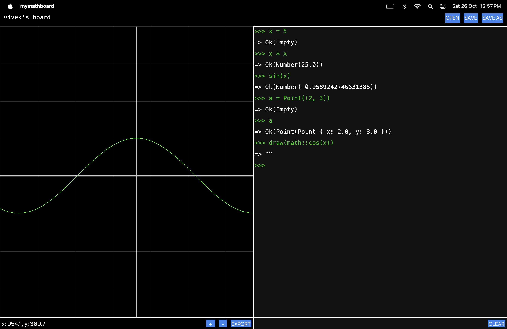

# mymathboard



mymathboard is an interactive tool for visualizing graphs and running calculations in a REPL-like interface.

<i> NOTE: this software is not released for public use as a binary yet and is currently being built on MacOS only. I am yet to test this on Windows and Linux.</i>

## todos

- [x] a REPL-like interface for doing math
- [x] a graphing interface for visualizing equations
- [x] zooming in the graph area
- [x] panning in the graph area
- [x] clear the REPL
- [x] export graph as PNG
- [x] dark theme
- [ ] display coordinates on axes
- [ ] add support for matrix calculations
- [ ] export graph as SVG
- [ ] test on windows
- [ ] test on linux
- [ ] website - description + REPL documentation + download page
- [ ] app signing, bundling with installers
- [ ] app updater
- [ ] release!

## requirements

1. Rust (>= v1.80.0)

## build

```bash
# development
cargo build

# release
cargo build --release
```

## license

created by Vivek Nathani ([@viveknathani_](https://twitter.com/viveknathani_)), licensed under the [MIT License](./LICENSE).